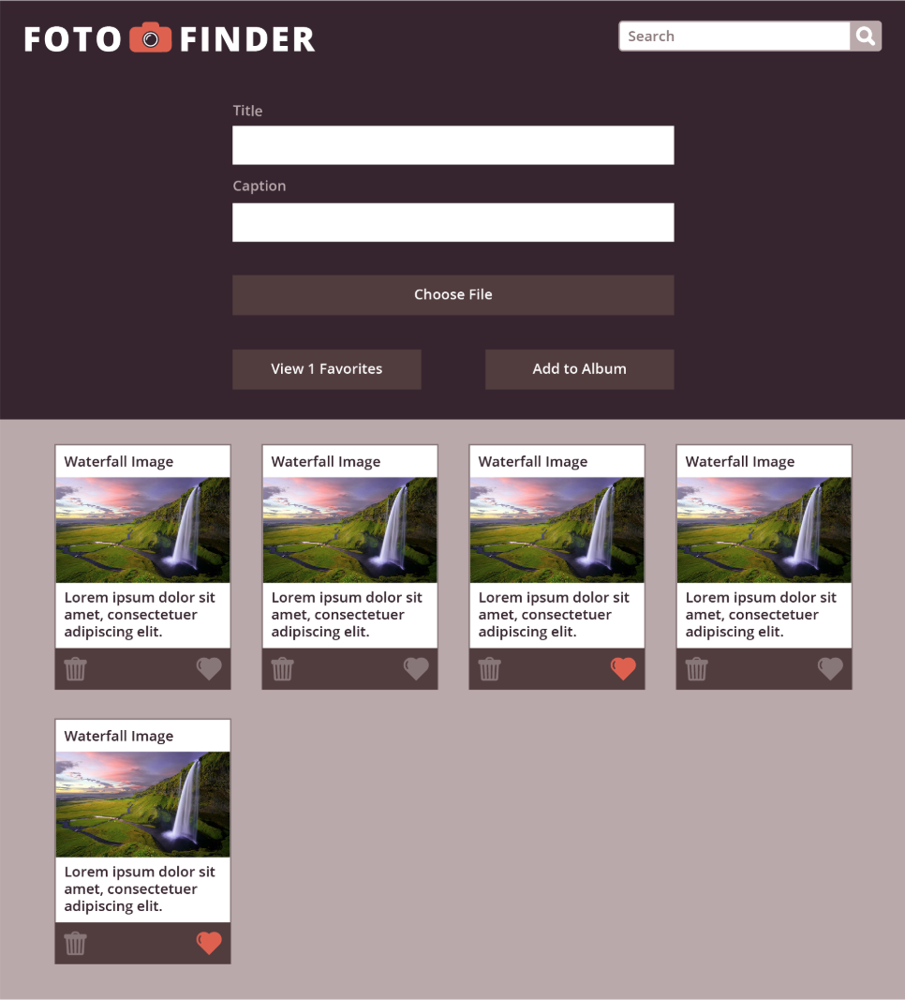
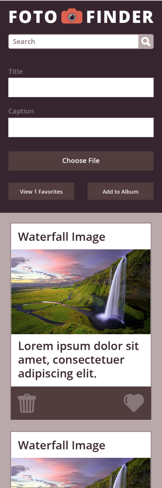
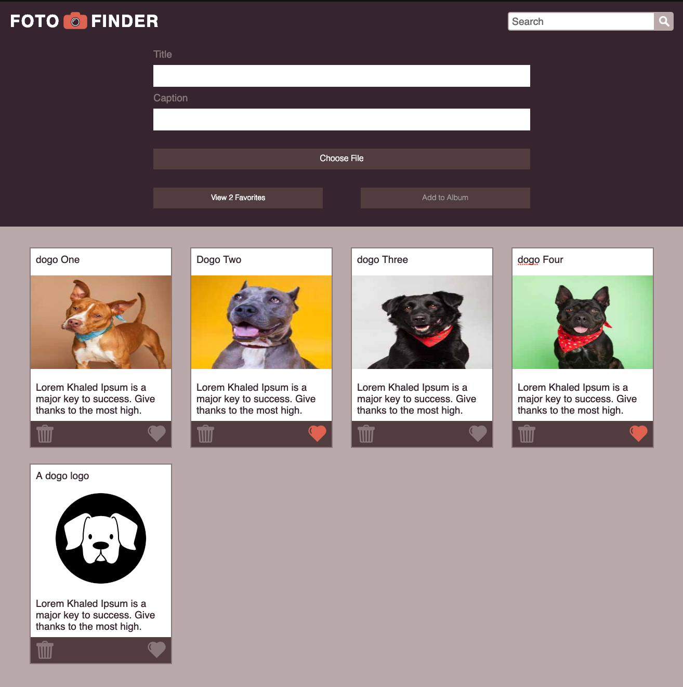
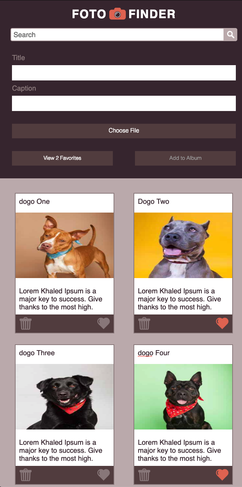
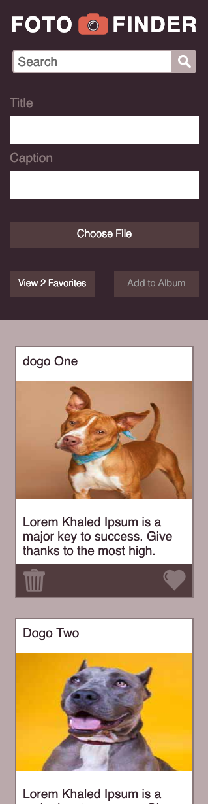

# Foto-Finder
### by Nim Garcia
## Intro
  This project is about creating a page that is both responsive and has many features including: 
  * Saving image to local storage
  * Photo title & caption editable
  * Favorite & filter favorited photos
  * Editing/Deleting of photo
  * Search title & caption 
  * Show/More less if greater than 10 photos
  * Each change with the exception of filtering persists on page reload
  
## Goals accomplished
1. Completed comp requirements
2. Completed extras such as animations & photo edit on-click
3. Improve user experience:
    * Form disappears when using search functionality
    * Visual indication to change image
    * Indicate which image is chosen in choose file btn
4. No global vars, if statements, used array prototypes when needed, functions are under 10 lines
5. Implement the use of grid for the album section

## Comp Provided

## My re-creation

## Instructions
* Type title
* Type caption
* Choose image
* Save Photo
* search for 'pickle' in the search bar